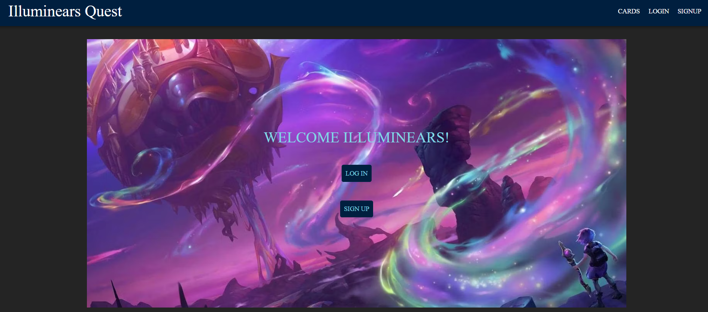

# Lorcana Deck Builder
  [](https://opensource.org/licenses/MIT)

Welcome to the Lorcana Deck Builder! This website is a tool for fans of the Disney card game Lorcana to create, edit, and save their decks. You can also edit deck names and save decks to your user profile.



  ## Table of Contents

  * [Features](#features)
  * [Technologies](#technologies-used)
  * [Installation](#installation)
  * [Usage](#usage)
  * [Deployment](#deployment)
  * [Contributing](#contributing)
  * [License](#license)
  * [Contact](#contact)


## Features

- **Create Decks**: Build your own custom decks using a wide variety of cards.
- **Edit Decks**: Modify your existing decks by adding or removing cards.
- **Save Decks**: Save your decks to your user profile for easy access and management.
- **Edit Deck Names**: Personalize your decks by changing their names.

## Technologies Used

  - React
  - Material-UI
  - Node.js
  - Express
  - MongoDB
  - JWT (JSON Web Tokens)
  - Render
  - Apollo 
 

- **Frontend**:
  - React
  - Material-UI
  - Axios

- **Backend**:
  - Node.js
  - Express

- **Database**:
  - MongoDB

- **State Management**:
  - Redux

- **Authentication**:
  - JWT (JSON Web Tokens)

- **Deployment**:
  - Render

- **Other Tools**:
  - Webpack
  - Babel

## Installation

To set up the project locally, follow these steps:

1. **Clone the repository**:

    ```sh
    git clone https://github.com/Velazqe/illuminears.git
    ```

2. **Navigate to the project directory**:

    ```sh
    cd illuminears
    ```

3. **Install dependencies**:

    ```sh
    npm install
    ```

4. **Start the development server**:

    ```sh
    npm start
    ```

5. **Open your browser** and navigate to `http://localhost:3000` to see the application in action.

## Usage

- **Search for Cards**: Use the search bar to find specific cards to add to your deck.
- **Add Cards to Deck**: Click on a card to add it to your current deck.
- **Remove Cards from Deck**: Click on a card in your deck to remove it.
- **Save Decks**: Click the save button to save your deck to your user profile.
- **Edit Deck Names**: Use the edit option to rename your decks.

## Deployment

The Lorcana Deck Builder is hosted on Render. You can access the live application using the following link: 

[Lorcana Deck Builder on Render](https://your-app-url-on-render.com)

## Contributing

We welcome contributions from the community! To contribute, follow these steps:

1. **Fork the repository**.
2. **Create a new branch**:

    ```sh
    git checkout -b feature-name
    ```

3. **Make your changes**.
4. **Commit your changes**:

    ```sh
    git commit -m "Add some feature"
    ```

5. **Push to the branch**:

    ```sh
    git push origin feature-name
    ```

6. **Open a pull request**.

## License

This project is licensed under the MIT License - see the [LICENSE](LICENSE) file for details.

## Contact

For any questions or suggestions, feel free to open an issue or contact us directly.
    - Nicholas Poulson: https://github.com/42Salokin
    - Justin Ramos: https://github.com/Jramos20022    
    - Emanuel Velazquez: https://github.com/Velazqe
